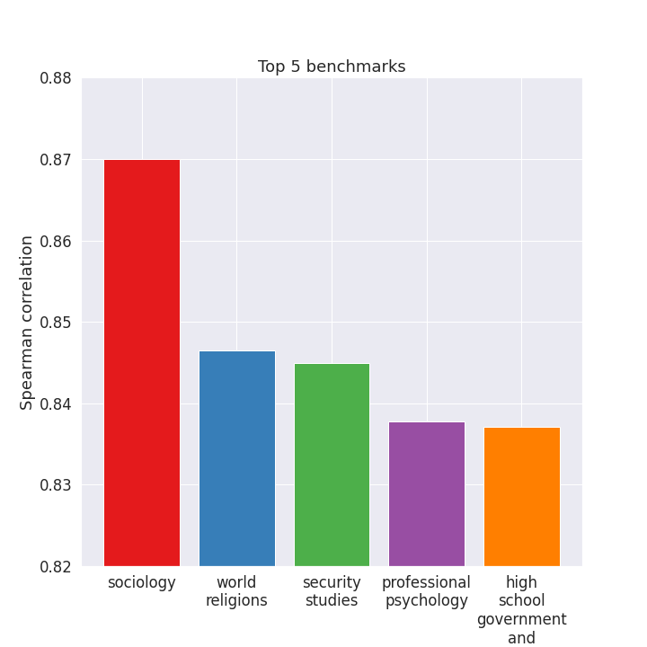
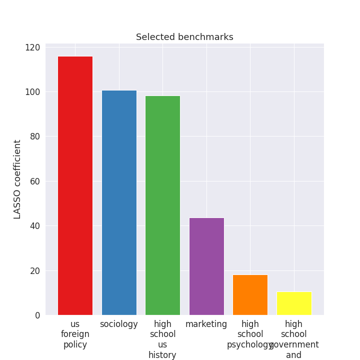

# Towards Understanding the Correlation between LLM Benchmarks

LLM evaluation is *super* tough:

- The gold standard requires human annotation, which is expensive and time-consuming.
- LLM-based evaluation has high correlation with human evaluation, but is still expensive.
- Classic benchmarks are cheap, but usually have low correlation with human evaluation.

In this toy project, I would like to obtain a better understanding of the correlation between LLM benchmarks with the hope that we can getting the best of both worlds: cheap and high correlation with human evaluation.

## Data Sources
Shout out to the following amazing projects:

- [Open LLM Leaderboard](https://huggingface.co/spaces/HuggingFaceH4/open_llm_leaderboard)
- [Chatbot Arena](https://huggingface.co/spaces/lmsys/chatbot-arena-leaderboard)
- [Alpaca Eval](https://tatsu-lab.github.io/alpaca_eval)

## Preliminary Findings
We use the human-evaluated Elo score from Chatbot Arena as the gold standard. We then compute the [Spearman correlation](https://en.wikipedia.org/wiki/Spearman%27s_rank_correlation_coefficient) between the Elo score and the benchmark results from Open LLM Leaderboard. 

Here are the top 5 benchmarks with the highest correlation:

And here are the top 5 benchmarks with the lowest correlation:

We then run LASSO regression over the benchmark results to see which benchmarks are the most important in predicting the Elo score. Here are the selected benchmarks:

With the selected benchmarks, we can predict the Elo score with a correlation of 0.94 over the test model set!

## Acknowledgement
This project is supported by [MyShell](https://myshell.ai/) open-source grant.